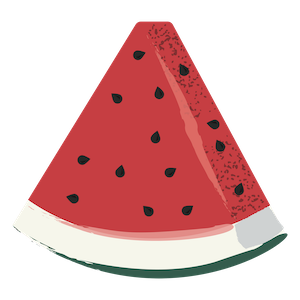

 <link rel="shortcut icon" type="image/x-icon" href="favicon.ico">

# Welcome

## Content

1. Automated e2e Testing
   1. [Approval Testing](/Automatede2eTesting//ApprovalTesting.md)
   2. [Locating Elements](/Automatede2eTesting//LocatingElements.md)
   3. [Page Objects](/Automatede2eTesting//PageObjects.md)
   4. [Parallel Execution](/Automatede2eTesting//ParallelExecution.md)
   5. [Separate or Same Code Repository](/Automatede2eTesting//SameCodeRepository.md)
   6. [Specification by Example: a Love Story](/Automatede2eTesting//SpecificationByExample.md)
   7. [Example Repositories](/Automatede2eTesting/ExampleRepos.md)
2. [Pride & Paradev Book](/PrideAndParadev.md)
3. [Code Coverage](/CodeCoverage.md)
4. [Computer Security Tips](/ComputerSecurity.md)
