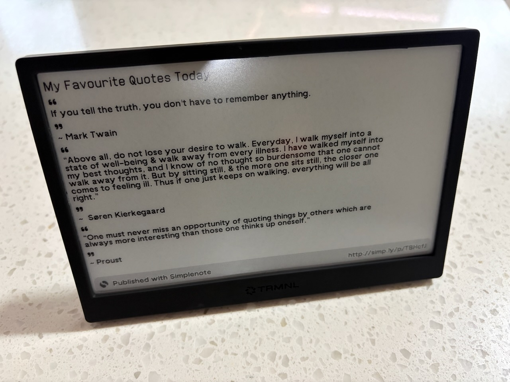
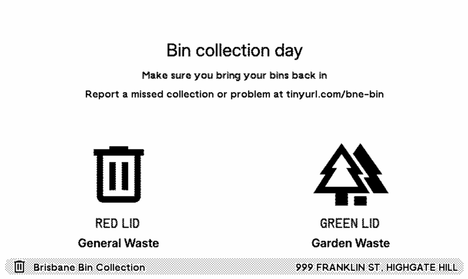

## Background

I am a big fan of [TRMNL](https://trmnl.com/) e-ink devices:

> TRMNL is an e-ink companion that helps you stay focused.

I have authored a number of open-source plugins for these devices:

1. TRMNL Brisbane Bin Collection Calendar: [src](https://github.com/alisterscott/trmnl-bne-bin)
2. TRMNL International Flip Date Clock [src](https://github.com/alisterscott/trmnl-flip-date) [install](https://trmnl.com/recipes/247379)
3. TRMNL Simplenote [src](https://github.com/alisterscott/trmnl-simplenote) [install](https://trmnl.com/recipes/236882)
4. TRMNL Translink [src](https://github.com/alisterscott/trmnl-translink) [install](https://trmnl.com/recipes/233040)



## TRMNL Template Repository

I created a template repository that makes it simple to get up and running on a new plugin, it specifies all the dependencies and even runs on a Github Codespaces instance with a few clicks. It also includes a Playwright example test that makes it easy to test your plugin which is useful when you have different user options and state that you wish to test via `trmnlp`.

The template repository is hosted here: https://github.com/alisterscott/trmnl-template


## Running `trmnlp` on a Github Codespaces instance

It's possible to run the [`trmnlp`](https://github.com/usetrmnl/trmnlp) development environment on a Github Codespaces instance with a few small tweaks:

In your `.devcontainer/devcontainer.json` make sure you have ruby installed (I use the Playwright docker image so I can run Playwright tests against my plugin screens, more on this below), and forward port 4567 for the trmnlp preview front end.

```json
{
  "image": "mcr.microsoft.com/playwright:v1.58.0",
  "forwardPorts": [6080, 4567],
  "postCreateCommand": "rbenv local && bundler install && npm install",
  "features": {
    "desktop-lite": {
      "webPort": "6080"
    },
    "ghcr.io/devcontainers/features/ruby:1": {},
    "git-lfs": "latest"
  }
}
```

I add a `Gemfile` and 

```
source 'https://rubygems.org'

gem 'trmnl_preview', '0.7.1'
```

Once this is set up you can use rbenv to set your ruby version (I use v3.4.8), run `bundler install` to install `trmnlp` and finally you can run:

`APP_ENV=production trmnlp serve` to start `trmnlp` which runs on port 4567 forwarded above.

Note the `APP_ENV=production` environment variable is required to allow the port forwarding on Codespaces to work and be accessible via an external address.

## Running Playwright Tests against trmnlp

Since `trmnlp` is just a local webserver it's easy to configure Playwright to test it.

In our `playwright.config.ts` we add

```typescript
use: {
  baseURL: "http://localhost:4567",
},
webServer: {
  command: "APP_ENV=production trmnlp serve",
  url: "http://localhost:4567",
  reuseExistingServer: !process.env.CI,
},
```

which tells Playwright to start the webserver to run tests and defining baseURL means we can do things like `await page.goto('/full')` without having to specifiy the webserver address.

The simplest test to make sure each route shows some content looks like:

```typescripe
const routes = ["/quadrant", "/full", "/half_vertical", "/half_horizontal"];

for (const route of routes) {
  await test.step(`Testing route: ${route}`, async () => {
    await page.goto(route);
    await page.getByRole("link", { name: "Poll" }).click();
    const trmnlFrame = page.frameLocator("iframe");
    await expect(
      trmnlFrame.locator("div.simplenotestart span.title"),
    ).toContainText("My Favourite Quotes Today");
  });
}
```

When all the tests are running you can see it cycling through different screens:

